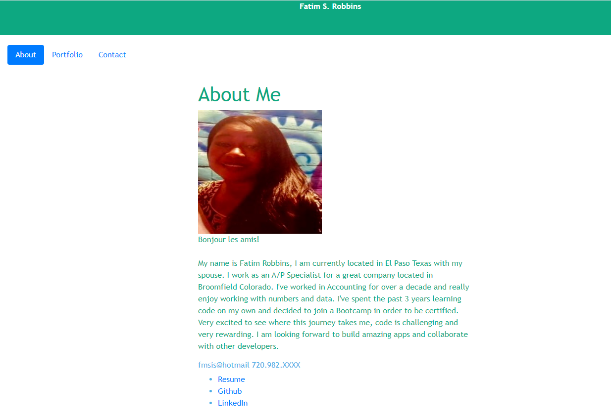

# Portfolio of Projects
Fatim Robbins' Portfolio of Projects

My portfolio consists of several apps and assignments built using HTML, CSS, Bootstrap, Javascript, Node.js, Express, MySQL, Axios, Passport, and Sequelize. The WathThis and Travel Genie Apps are group projects with 7 other talented developers. 
 

# Screenshotsof the site 

Link to my Portfolio- https://melodie15.github.io/fatimrobbins.updateportfolio.github.io/
